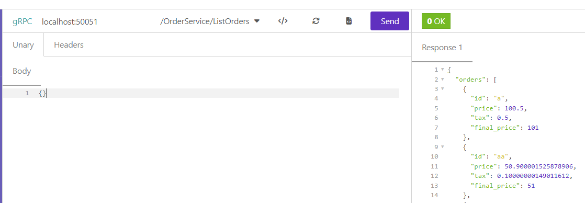

# go-clean-architecture

Agora é a hora de botar a mão na massa. Pra este desafio, você precisará criar o usecase de listagem das orders.

Esta listagem precisa ser feita com:

- Endpoint REST (GET /order)
- Service ListOrders com GRPC
- Query ListOrders GraphQL

Não esqueça de criar as migrações necessárias e o arquivo api.http (para executar com a extensão Rest Client VSCode) com a request para criar e listar as orders.

---

## Pré-requisito

- golang-migrate

## Como executar a aplicação?

O primeiro passo é instanciar os contêineres:

```
docker compose up -d
```

Em seguida, execute as migrações com o comando:

```
make migrate_up
```

Com a estrutura do banco de dados criada, execute os seguintes comandos para iniciar a aplicação REST, GraphQL e GRPC
```
cd cmd/ordersystem
go run main.go wire_gen.go
```

## REST

No diretório **api** foi disponibilizado os arquivos **http** para serem executados com a extensão REST Client (VSCode).

## GraphQL Playground

localhost:8080

```
mutation orders {
  createOrder(input: {id: "ab", Price: 50.90, Tax: 0.10}) {
    id
    Price
    Tax
    FinalPrice
  }
}

query list_orders {
  ListOrders{
    id
    Price
    Tax
    FinalPrice
  }
}
```

## GRPC

Para executar os comandos via GRPC você pode usar o client que lhe agrade, como por exemplo o Evans através do comando `evans -r rpl` ou o Postman e Insomnia.

Exemplo com Insomnia:



## Anotações para desenvolvedor

### Para gerar/atualizar os protobuffers

No diretório raíz do projeto, execute:

```
protoc --proto_path=internal/infra/grpc/protofiles --go_out=internal/infra/grpc/pb --go_opt=paths=source_relative \
  --go-grpc_out=internal/infra/grpc/pb --go-grpc_opt=paths=source_relative \
  internal/infra/grpc/protofiles/order.proto
```

### Para gerar/atualizar os arquivos do GraphQL, execute:

```
go run github.com/99designs/gqlgen generate
```

### Instalar golang-migrate no Ubuntu

```
curl -L https://packagecloud.io/golang-migrate/migrate/gpgkey > key.gpg
sudo apt-key add key.gpg
echo "deb https://packagecloud.io/golang-migrate/migrate/ubuntu/ $(lsb_release -sc) main" | sudo tee /etc/apt/sources.list.d/migrate.list
apt-get update
apt-get install -y migrate
```